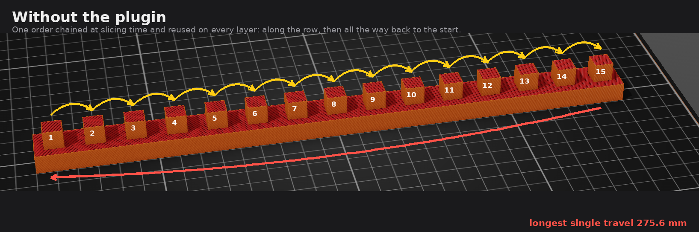
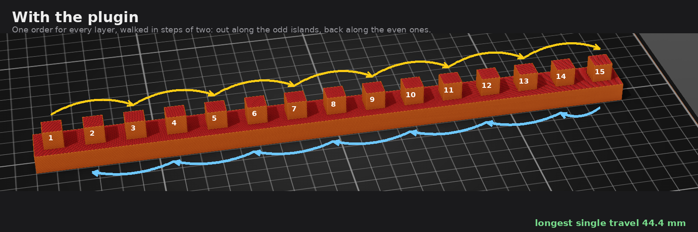

# Island print order — a PrusaSlicer slicing plugin

A `slicing.island_order` plugin for PrusaSlicer 3.x. It decides the order in which the
disjoint islands of a layer are printed.

## The problem

When an object splits into several separate regions on a layer — towers above a common
base, a plate with many parts on it — the stock slicer chains those islands once, at
slicing time, and reuses that order for every layer. The head walks the row and then jumps
all the way back to the start.

**That single long jump is the problem.** On the test model it is 276 mm — far beyond what
a normal retraction covers, so the nozzle oozes on the way and strings on arrival. Total
travel is a side issue; the length of the *longest individual* travel is what shows up on
the print.



The obvious fix — reversing the order on every layer — kills the jump and cuts total travel
by 28 %, but it quietly breaks something else. The island at the turning point is the last
one printed on a layer and the first one on the next, so it gets no time at all to
solidify. Measured on the test model, 47 % of all island revisits then happen sooner than
the 10 s the filament profile asks for, against 3 % for stock.

## What this does

The default `cooling` mode keeps the island order **stable across layers**, which is what
gives every island a full layer time to cool — the most any ordering can give it — and
walks the tour in steps of two, out along one parity and back along the other. On a row of
islands `1..n` that prints `1,3,5,...,n` then `n-1,...,4,2`. Three things follow:

- the tour's longest edge, the one that closes the loop, is never travelled;
- every travel spans at most two island gaps instead of the whole print;
- the sequence ends next to where the next layer starts, so each island is revisited
  exactly one layer time after it was left.



The return sweep is what buys the cooling: island 2 is printed near the end of the layer and
island 1 near the start of the next, which are neighbours, so the head never has to cross the
whole print to get from one layer to the next.

## Measurements

Test model: 300 × 20 × 20 mm, a base plate that splits into 15 islands in a row above
z = 10 mm. Original Prusa XL, 0.20 mm SPEED, Prusament PLA (`slowdown_below_layer_time`
= 10 s). Seven runs per mode, measured by `tools/travel.py` and `tools/cooling.py` reading
the emitted G-code, not the slicer's own accounting.

| mode | total travel | sd | print time | shortest cooling gap | revisits < 10 s | longest single travel |
|---|---|---|---|---|---|---|
| stock | 40 455 mm | 771 | 69.6 min | 0.02 s | 3.0 % | **275.6 mm** |
| `travel` | 29 020 mm | 0.2 | 69.1 min | 0.02 s | **46.9 %** | 24.4 mm |
| **`cooling`** (default) | 42 104 mm | 0.2 | 69.9 min | **10.87 s** | **0.0 %** | **44.4 mm** |

Extruded length was 343 739.4 mm in all 21 runs: the plugin changes the order only, never
the geometry or the amount of material.

The default trades 4 % more total travel and 0.3 min of print time for a longest travel
6.2× shorter than stock, with **no** revisit below the filament's cooling threshold and a
cooling time that is essentially constant across islands (10.87 s min, 10.90 s median).

It also makes the result reproducible. Stock ordering varies by about 2 % between runs of
the same input; both plugin modes have a spread of 0.2 mm.

## Settings

`settings.lua` sits next to the plugin. Edit it and re-slice — no restart, no rescan.

| key | default | meaning |
|---|---|---|
| `mode` | `"cooling"` | `"cooling"` layer-stable, alternating walk. `"travel"` shortest travel, seeded from the head, reverses every layer. `"stock"` leave the slicer's order alone, for A/B. |
| `max_two_opt_islands` | `100` | Above this many islands on a layer, 2-opt is skipped and the greedy chain is used as is. |

## Requirements

**This plugin does not work with an official PrusaSlicer release.** The `slicing.island_order` API does
not exist in PrusaSlicer 3.x as shipped; it is added by a fork:

- fork, branch `feature/island-ordering-plugin-api`: https://github.com/dzwiedziu-nkg/PrusaSlicer/tree/feature/island-ordering-plugin-api
- how to build and run it: https://github.com/dzwiedziu-nkg/PrusaSlicer/blob/feature/island-ordering-plugin-api/doc/Build_plugin_fork.md
- the API contract: `doc/Plugin_API.md` in those sources

Prusa have said they intend to expose the slicing pipeline to plugins themselves. When they
do, this plugin should be rewritten against their interface and the fork dropped.

## Installing

Symlink or copy the bundle directory into the slicer's plugin directory. The directory
name has to match the `id` in `manifest.json`.

```bash
ln -s "$PWD/com.github.dzwiedziu-nkg.island-order" ~/.config/PrusaSlicer/lua/
```

The plugin has no menu entry — it is not user invoked. The log reports which island
ordering plugin is in use at the start of every export:

```
[info] Island ordering plugin in use: com.github.dzwiedziu-nkg.island-order.island_order
```

To turn it off, remove the bundle from the plugin directory, or set `mode = "stock"`.

## Measuring

`tools/travel.py` sums the non-extruding moves in a G-code file and is model independent.

`tools/figures.py <screenshot> <output dir>` redraws the two diagrams above over a
screenshot of the test model. The pillar positions are measured off that screenshot and are
listed at the top of the script; re-measure them if it is retaken.

`tools/cooling.py` reports, per island, the time between finishing it on one layer and
starting it again on the next, plus the distribution of individual travel hops. It
identifies islands by X coordinate and is therefore **specific to the row-of-pillars test
model**; adapt `PILLAR_*` for anything else.

## Limitations

- Distances are measured between island centroids, not between the actual exit and entry
  points of the head, and they ignore `avoid_crossing_perimeters`, retraction and z-hop.
- The cooling guarantee is structural: it says every island is revisited one layer time
  after it was left. Whether one layer time is *enough* is the slicer's job, through
  `slowdown_below_layer_time`, which stretches short layers to that floor. Ordering cannot
  create cooling time that the layer does not have.
- The order is stable only while the set of islands is stable. Where the geometry changes
  from one layer to the next the tour is recomputed, and one revisit may fall short.
- One object instance is ordered per call; the order between instances is decided
  elsewhere in the slicer.

## License

AGPL-3.0-only, the same licence as PrusaSlicer itself. The full text is in `LICENSE`.
